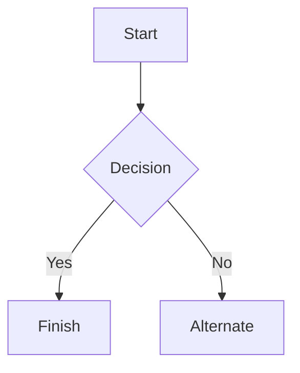

# A diagram in a document

Prose before.


```mermaid
graph TD
  A[Start] --> B{Decision}
  B -->|Yes| C[Finish]
  B -->|No| D[Alternate]
```

Prose after, and an ordinary fence:

```js
const x = 1;
```
